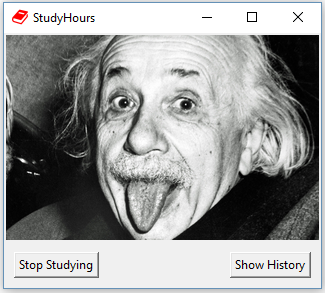
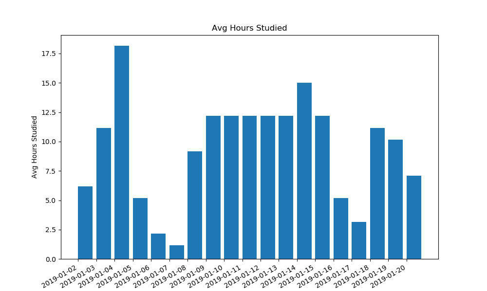
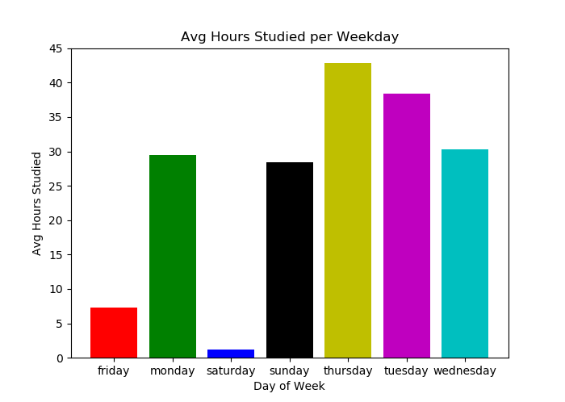

# StudyHours

I just wanted a small tool to help keep me productive and track the numbers of hours I'm studying/being productive.
Since everything out there is mostly too complex for my usecase, I decided hey, why not do it myself?

So here is Studyhours:
1.   Open the studyhours.py file to start tracking time
2.   Press the Stop button to stop tracking
3.   The csv file at ./data/studyhours.csv gets updated

You also get a few simple charts to visualize your history on the click of a button!

## Current version

I'd call this v0.9 - kind of usable but not totally ready yet, still need to iron out a few things

To do:
- make avg hour chart actually avg instead of total
- compile .exe file (so everyone can use it)
- make it auto-create a ./data/ directory with csv file in it

## Screenshots:

### Charts:

  
  

   

Please feel free to download & use/modify however you want.
If you have any suggestions in regards to code/features, I'm open to advice :)
